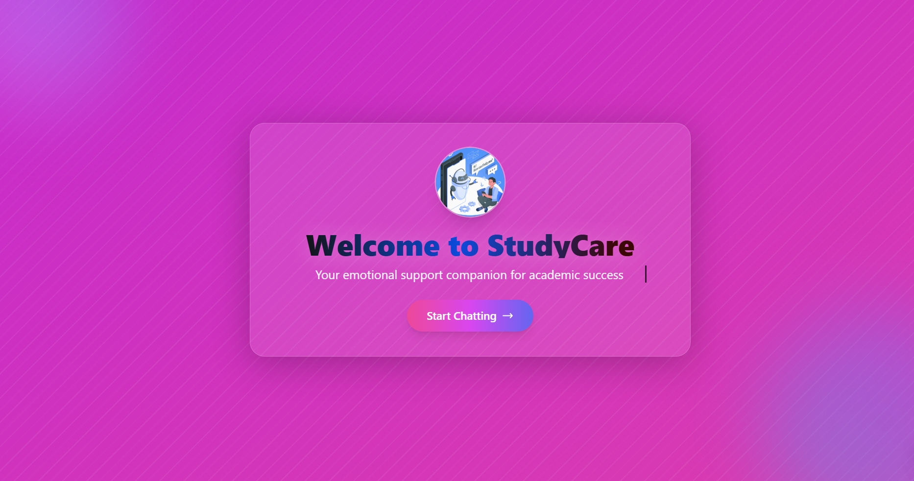
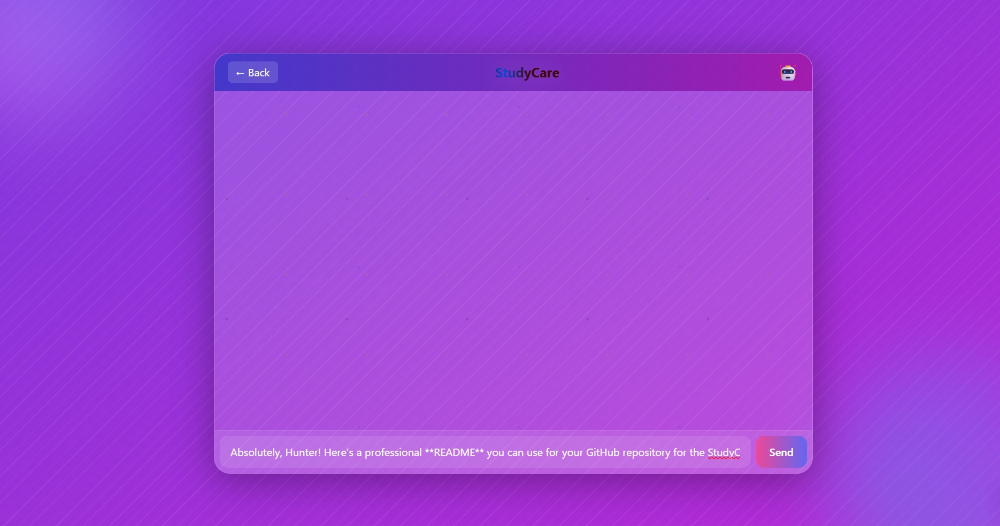

---

# StudyCare • AI Chatbot


StudyCare is an **AI-powered chatbot** designed to provide emotional and academic support for students. It serves as a friendly virtual companion, assisting with queries, motivation, and guidance in an interactive and visually engaging interface.

---

## 🚀 Features

* **Real-time Chat Interface** – Send and receive messages instantly.
* **AI Responses** – Powered by a backend AI server for intelligent replies.
* **Typing Animation & Emoji Feedback** – Realistic typing and responsive emojis for a lively conversation.
* **Beautiful UI** – Gradient background with floating particles, animated orbs, and glowing logo.
* **Responsive Design** – Works seamlessly on desktop and mobile screens.
* **Start / Back Navigation** – Smooth transition between welcome screen and chat interface.

---

## 🖥️ Screenshots

**Landing Screen:**


**Chat Screen:**
 *(Replace with your screenshot)*

---

## 📦 Installation

1. **Clone the repository:**

```bash
git clone https://github.com/your-username/studycare-ai-chatbot.git
```

2. **Navigate to the project folder:**

```bash
cd studycare-ai-chatbot
```

3. **Install backend dependencies (if using Node.js):**

```bash
npm install
```

4. **Start the backend server (example for Node.js/Express):**

```bash
npm start
```

5. **Open `index.html` in your browser** for the frontend.

> ⚠️ Ensure the backend is running on `http://localhost:5000` or update the fetch URL in `index.html` accordingly.

---

## 🛠️ Technologies Used

* **Frontend:** HTML, CSS, TailwindCSS, JavaScript
* **Backend:** Node.js + Express / Python Flask (any AI server backend)
* **AI:** Custom chatbot API for generating responses
* **Animations:** CSS keyframes for gradients, particles, and floating orbs

---

## 🌈 UI / UX Highlights

* Animated **gradient background** and **floating orbs**
* **GIF logo** with aura effect
* Typing indicator and dynamic **emoji reactions**
* Smooth **transition between landing and chat screens**

---

## 🧩 Usage

1. Open the landing page (`index.html`).
2. Click **Start Chatting** to open the chat window.
3. Type your message and press **Enter** or click **Send**.
4. Interact with the AI chatbot and enjoy visual feedback with animated emojis.
5. Click **Back** to return to the welcome screen.

---

## 🤝 Contribution

Contributions are welcome!

1. Fork the repository
2. Create a new branch (`git checkout -b feature-name`)
3. Commit your changes (`git commit -m "Add new feature"`)
4. Push to the branch (`git push origin feature-name`)
5. Open a Pull Request

---

📄 License

This project is **MIT Licensed** – see the [LICENSE](LICENSE) file for details.

---

📬 Contact

**Author:** Hunter (Ayush Agnihotri)
**GitHub:** [https://github.com/TheHUNTER2714](https://github.com/TheHUNTER2714)
**Email:** [hunter@example.com](Ayushagnihotri964@gmail.com)
**Live Demo:** https://studycarechatbot.netlify.app/
---


